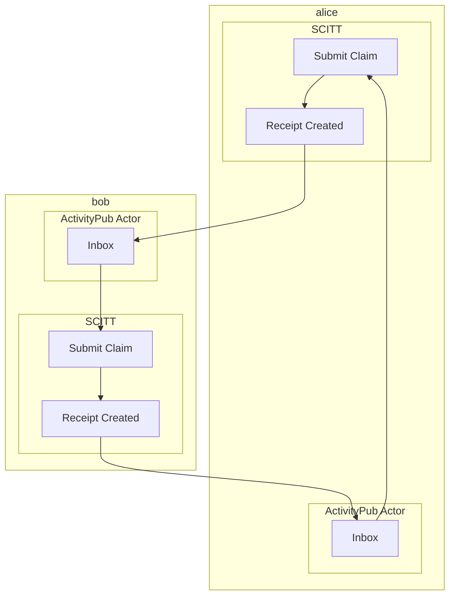

# Federation via ActivityPub

- Federation of SCITT events enables near real-time communication between supply
  chains.
    - Acceptance of claims to SCITT where payload data contains VEX, CSAF, VSA,
      SBOM, VDR, VRF, S2C2F alignment attestations, etc. has the side effect of
      enabling a consistent pattern for notification of new vulnerability
      and other Software Supply Chain Security data.
- References
  - [SCITT Architecture: 7. Federation](https://www.ietf.org/archive/id/draft-ietf-scitt-architecture-02.html#name-federation)
  - https://www.w3.org/TR/activitypub/
  - [OpenSSF Stream 8](https://8112310.fs1.hubspotusercontent-na1.net/hubfs/8112310/OpenSSF/OSS%20Mobilization%20Plan.pdf):
    Coordinate Industry-Wide Data Sharing to Improve the Research That Helps
    Determine the Most Critical OSS Components



## Dependencies

Install the SCITT API Emulator with the `federation-activitypub-bovine` extra.

```console
$ pip install -e .[federation-activitypub-bovine]
```

## Example of Federating Claims / Receipts Across SCITT Instances

> Please refer to the [Registration Policies](registration_policies.md) doc for
> more information about claim insert policies.

In this example Alice and Bob each have their own instance of SCITT. Alice's
insert policy differs from Bob's slightly. Alice and Bob's instances federate
with each other. This means when claims are inserted into one instance and are
given and entry ID and a receipt at notification is sent to the other instance.
The other instance decides if it wants to create a corresponding entry ID and
receipt local to it.

Federation can be helpful when some aspects of insert policy validation are
shared. By federating with entities an instance trusts for those aspects of
insert policy and instance and it's owner(s) may be able to reduce investment in
compute or other activities required for claim validation.

As a more specific example, entities may share a common set of insert policy
criteria defined in a collaborative manner (such as a working group).
Attestations of alignment to the [S2C2F](https://github.com/ossf/s2c2f/blob/main/specification/framework.md#appendix-relation-to-scitt)
are one such example. In addition to the requirements / evaluation criteria
defined by the OpenSSF's Supply Chain Integrity Working Group an entity may
desire to evaluate attestations of alignment with added requirements appropriate
to their usage/deployment context and it's threat model.

By the end of this tutorial you will have four terminals open.

- One for the ActivityPub Server
- One for Bob's SCITT Instance
- One for Alice's SCITT Instance
- One for submitting claims to Bob and Alice's SCITT instances and querying
  their ActivityPub Actors.


### Bring up the ActivityPub Server

First we install our dependencies

- https://codeberg.org/bovine/bovine
  - Most of the tools need to be run from the directory with the SQLite database in them (`bovine.sqlite3`)
- https://bovine-herd.readthedocs.io/en/latest/deployment.html
  - Bovine and associated libraries **require Python 3.11 or greater!!!**

```console
$ python --version
Python 3.11.5
$ python -m venv .venv && \
    . .venv/bin/activate && \
    pip install -U pip setuptools wheel && \
    pip install \
      toml \
      bovine{-store,-process,-pubsub,-herd,-tool} \
      'https://codeberg.org/pdxjohnny/bovine/archive/activitystreams_collection_helper_enable_multiple_iterations.tar.gz#egg=bovine&subdirectory=bovine' \
      'https://codeberg.org/pdxjohnny/mechanical_bull/archive/event_loop_on_connect_call_handlers.tar.gz#egg=mechanical-bull'
```

We create a basic ActivityPub server.

**~/Documents/fediverse/bovine_herd_server/app.py**

```python
from quart import Quart

from bovine_herd import BovineHerd
from bovine_pubsub import BovinePubSub

app = Quart(__name__)
BovinePubSub(app)
BovineHerd(app)
```

We'll run on port 5000 to avoid collisions with common default port choices.
Keep this running for the rest of the tutorial.

> **TODO** Integrate Quart app launch into `SCITTFederationActivityPubBovine`
> initialization.

```console
$ rm -rf *sqlite* && BUTCHER_ALLOW_HTTP=1 hypercorn app:app -b 0.0.0.0:5000
[2023-10-16 02:44:48 -0700] [36467] [INFO] Running on http://0.0.0.0:5000 (CTRL + C to quit)
```

> Cleanup: `rm -f *sqlite* federation_*/config.toml`

### Bring up Bob's SCITT Instance

Populate Bob's federation config

**~/Documents/fediverse/scitt_federation_bob/config.json**

```json
{
  "domain": "http://localhost:5000",
  "handle_name": "bob",
  "workspace": "~/Documents/fediverse/scitt_federation_bob",
  "following": {
    "alice": {
      "actor_id": "acct:alice@localhost:5000",
      "domain": "http://localhost:5000"
    }
  }
}
```

Start the server

```console
$ rm -rf workspace_bob/
$ mkdir -p workspace_bob/storage/operations
$ BOVINE_DB_URL="sqlite://${HOME}/Documents/fediverse/bovine_herd_server/bovine.sqlite3" scitt-emulator server \
    --workspace workspace_bob/ --tree-alg CCF --port 6000 \
    --federation scitt_emulator.federation_activitypub_bovine:SCITTFederationActivityPubBovine \
    --federation-config-path ${HOME}/Documents/fediverse/scitt_federation_bob/config.json
```

> **TODO** Figure out why the server was restarting constantly if in
> scitt-api-emulator directory (sqlite3?).
>
> ```console
> $ rm -f ~/Documents/fediverse/scitt_federation_bob/config.toml && BOVINE_DB_URL="sqlite://${HOME}/Documents/fediverse/bovine/hacking/bovine.sqlite3" scitt-emulator server --workspace workspace_bob/ --tree-alg CCF --port 6000     --federation scitt_emulator.federation_activitypub_bovine:SCITTFederationActivityPubBovine     --federation-config-path ~/Documents/fediverse/scitt_federation_bob/config.json 
> ```

Create claim from allowed issuer (`.org`) and from non-allowed (`.com`).

```console
$ scitt-emulator client create-claim --issuer did:web:example.com --content-type application/json --payload '{"sun": "yellow"}' --out claim.cose
Claim written to claim.cose
$ scitt-emulator client submit-claim --url http://localhost:6000 --claim claim.cose --out claim.receipt.cbor
Claim registered with entry ID 1
Receipt written to claim.receipt.cbor
$ scitt-emulator client create-claim --issuer did:web:example.org --content-type application/json --payload '{"sun": "yellow"}' --out claim.cose
Claim written to claim.cose
$ scitt-emulator client submit-claim --url http://localhost:6000 --claim claim.cose --out claim.receipt.cbor
Claim registered with entry ID 2
Receipt written to claim.receipt.cbor
```

### Bring up Alice's SCITT Instance

Populate Alice's federation config

**~/Documents/fediverse/scitt_federation_alice/config.json**

```json
{
  "domain": "http://localhost:5000",
  "handle_name": "alice",
  "workspace": "~/Documents/fediverse/scitt_federation_alice",
  "following": {
    "bob": {
      "actor_id": "acct:bob@localhost:5000",
      "domain": "http://localhost:5000"
    }
  }
}
```

Start the server

```console
$ rm -rf workspace_alice/
$ mkdir -p workspace_alice/storage/operations
$ BOVINE_DB_URL="sqlite://${HOME}/Documents/fediverse/bovine_herd_server/bovine.sqlite3" scitt-emulator server \
    --workspace workspace_alice/ --tree-alg CCF --port 7000 \
    --federation scitt_emulator.federation_activitypub_bovine:SCITTFederationActivityPubBovine \
    --federation-config-path ${HOME}/Documents/fediverse/scitt_federation_alice/config.json
```

Create claim from allowed issuer (`.org`) and from non-allowed (`.com`).

```console
$ scitt-emulator client create-claim --issuer did:web:example.com --content-type application/json --payload '{"sun": "yellow"}' --out claim.cose
Claim written to claim.cose
$ scitt-emulator client submit-claim --url http://localhost:7000 --claim claim.cose --out claim.receipt.cbor
Traceback (most recent call last):
  File "/home/alice/.local/bin/scitt-emulator", line 33, in <module>
    sys.exit(load_entry_point('scitt-emulator', 'console_scripts', 'scitt-emulator')())
  File "/home/alice/Documents/python/scitt-api-emulator/scitt_emulator/cli.py", line 22, in main
    args.func(args)
  File "/home/alice/Documents/python/scitt-api-emulator/scitt_emulator/client.py", line 196, in <lambda>
    func=lambda args: submit_claim(
  File "/home/alice/Documents/python/scitt-api-emulator/scitt_emulator/client.py", line 107, in submit_claim
    raise_for_operation_status(operation)
  File "/home/alice/Documents/python/scitt-api-emulator/scitt_emulator/client.py", line 43, in raise_for_operation_status
    raise ClaimOperationError(operation)
scitt_emulator.client.ClaimOperationError: Operation error denied: 'did:web:example.com' is not one of ['did:web:example.org']

Failed validating 'enum' in schema['properties']['issuer']:
    {'enum': ['did:web:example.org'], 'type': 'string'}

On instance['issuer']:
    'did:web:example.com'

$ scitt-emulator client create-claim --issuer did:web:example.org --content-type application/json --payload '{"sun": "yellow"}' --out claim.cose
Claim written to claim.cose
$ scitt-emulator client submit-claim --url http://localhost:7000 --claim claim.cose --out claim.receipt.cbor
Claim registered with entry ID 1
Receipt written to claim.receipt.cbor
```
