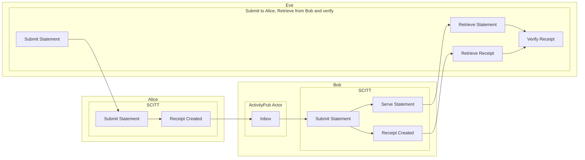

# Federation via ActivityPub

- Federation of SCITT events enables near real-time communication between supply
  chains.
    - Acceptance of claims to SCITT where payload data contains VEX, CSAF, VSA,
      SBOM, VDR, VRF, S2C2F alignment attestations, etc. has the side effect of
      enabling a consistent pattern for notification of new vulnerability
      and other Software Supply Chain Security data.
- References
  - [SCITT Architecture: 7. Federation](https://www.ietf.org/archive/id/draft-ietf-scitt-architecture-02.html#name-federation)
  - https://www.w3.org/TR/activitypub/
  - [OpenSSF Stream 8](https://openssf.org/oss-security-mobilization-plan/):
    Coordinate Industry-Wide Data Sharing to Improve the Research That Helps
    Determine the Most Critical OSS Components



> Below links to recording of IETF 118 SCITT Meeting, Corresponding asciinema link: https://asciinema.org/a/619517

[](https://www.youtube.com/watch?v=zEGob4oqca4&t=5354s)

## Dependencies

Install the SCITT API Emulator with the `federation-activitypub-bovine` extra.

- https://bovine-herd.readthedocs.io/en/latest/deployment.html
  - Bovine and associated libraries **require Python 3.11 or greater!!!**

```console
$ pip install -e .[federation-activitypub-bovine]
```

## Example of Federating Statements / Receipts Across SCITT Instances

> Please refer to the [Registration Policies](registration_policies.md) doc for
> more information about claim insert policies.

In this example Alice and Bob each have their own instance of SCITT. Alice's
insert policy differs from Bob's slightly. Alice and Bob's instances federate
with each other. This means when claims are inserted into one instance and are
given and entry ID and a receipt at notification is sent to the other instance.
The other instance decides if it wants to create a corresponding entry ID and
receipt local to it.

Federation can be helpful when some aspects of insert policy validation are
shared. By federating with entities an instance trusts for those aspects of
insert policy and instance and it's owner(s) may be able to reduce investment in
compute or other activities required for claim validation.

As a more specific example, entities may share a common set of insert policy
criteria defined in a collaborative manner (such as a working group).
Attestations of alignment to the [S2C2F](https://github.com/ossf/s2c2f/blob/main/specification/framework.md#appendix-relation-to-scitt)
are one such example. In addition to the requirements / evaluation criteria
defined by the OpenSSF's Supply Chain Integrity Working Group an entity may
desire to evaluate attestations of alignment with added requirements appropriate
to their usage/deployment context and it's threat model.

By the end of this tutorial you will have four terminals open.

- One for the ActivityPub Server
- One for Bob's SCITT Instance
- One for Alice's SCITT Instance
- One for submitting claims to Bob and Alice's SCITT instances and querying
  their ActivityPub Actors.

### S2C2F Notes

- ING-4: Mirror a copy of all OSS source code to an internal location
  - One might also want to mirror trust attestations, integrity data, etc. to
    ensure availability. Federation could assist with keeping mirrors as up to
    date as possible.

### Bring up Bob's SCITT Instance

Populate Bob's federation config

**~/Documents/fediverse/scitt_federation_bob/config.json**

```json
{
  "handle_name": "bob",
  "fqdn": "scitt.bob.chadig.com",
  "workspace": "~/Documents/fediverse/scitt_federation_bob/",
  "bovine_db_url": "~/Documents/fediverse/scitt_federation_bob/bovine.sqlite3",
  "following": {
    "alice": {
      "actor_id": "alice@scitt.alice.chadig.com"
    }
  }
}
```

Start the server

```console
$ rm -rf workspace_bob/
$ mkdir -p workspace_bob/storage/operations
$ scitt-emulator server \
    --workspace ${HOME}/Documents/fediverse/scitt_federation_bob/workspace_bob/ --tree-alg CCF --port 6000 \
    --middleware scitt_emulator.federation_activitypub_bovine:SCITTFederationActivityPubBovine \
    --middleware-config-path ${HOME}/Documents/fediverse/scitt_federation_bob/config.json
```

### Bring up Alice's SCITT Instance

Populate Alice's federation config

**~/Documents/fediverse/scitt_federation_alice/config.json**

```json
{
  "handle_name": "alice",
  "fqdn": "scitt.alice.chadig.com",
  "workspace": "~/Documents/fediverse/scitt_federation_alice/",
  "bovine_db_url": "~/Documents/fediverse/scitt_federation_alice/bovine.sqlite3",
  "following": {
    "bob": {
      "actor_id": "bob@scitt.bob.chadig.com"
    }
  }
}
```

Start the server

```console
$ rm -rf workspace_alice/
$ mkdir -p workspace_alice/storage/operations
$ scitt-emulator server \
    --workspace ${HOME}/Documents/fediverse/scitt_federation_alice/workspace_alice/ --tree-alg CCF --port 7000 \
    --middleware scitt_emulator.federation_activitypub_bovine:SCITTFederationActivityPubBovine \
    --middleware-config-path ${HOME}/Documents/fediverse/scitt_federation_alice/config.json
```

### Create and Submit Statement to Alice's Instance

```console
$ scitt-emulator client create-claim --issuer did:web:example.org --content-type application/json --subject solar --payload '{"sun": "yellow"}' --out claim.cose
Claim written to claim.cose
$ scitt-emulator client submit-claim --url http://localhost:7000 --claim claim.cose --out claim.receipt.cbor
Claim registered with entry ID sha384:76303a87c3ff728578d1e941ec4422193367e31fd37ab178257536cba79724d6411c457cd3c47654975dc924ff023123
Receipt written to claim.receipt.cbor
```

### Download Receipt from Bob's Instance

```console
$ scitt-emulator client retrieve-claim --url http://localhost:6000 --out federated.claim.cose --entry-id sha384:76303a87c3ff728578d1e941ec4422193367e31fd37ab178257536cba79724d6411c457cd3c47654975dc924ff023123
Claim written to federated.claim.cose
$ scitt-emulator client retrieve-receipt --url http://localhost:6000 --out federated.claim.receipt.cbor --entry-id sha384:76303a87c3ff728578d1e941ec4422193367e31fd37ab178257536cba79724d6411c457cd3c47654975dc924ff023123
Receipt written to federated.claim.receipt.cbor
$ scitt-emulator client verify-receipt --claim federated.claim.cose --receipt federated.claim.receipt.cbor --service-parameters workspace_alice/service_parameters.json
Leaf hash: 7d8501f1aea9b095b9730dab05f8866c0c9d0e33e6f3f2c7131ff4a3ca1ddf61
Root: fceb0aa5ac260542753b5086d512fe3bb074ef39ac3becc5d9ce857b020b85fb
Receipt verified
```
